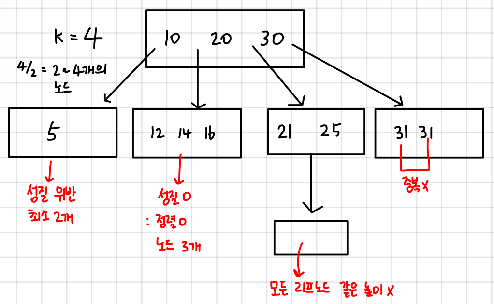
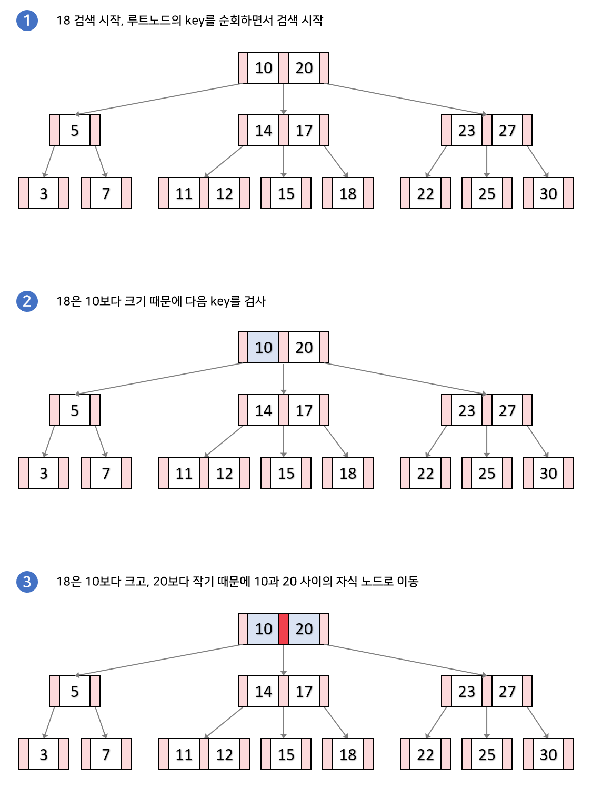
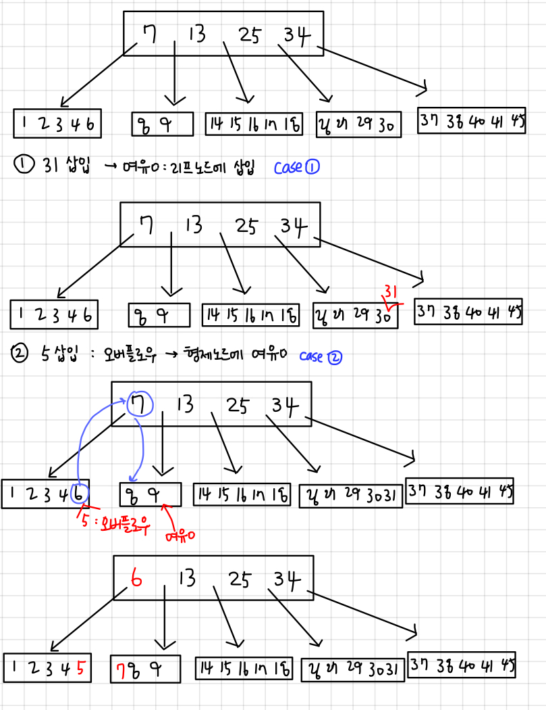
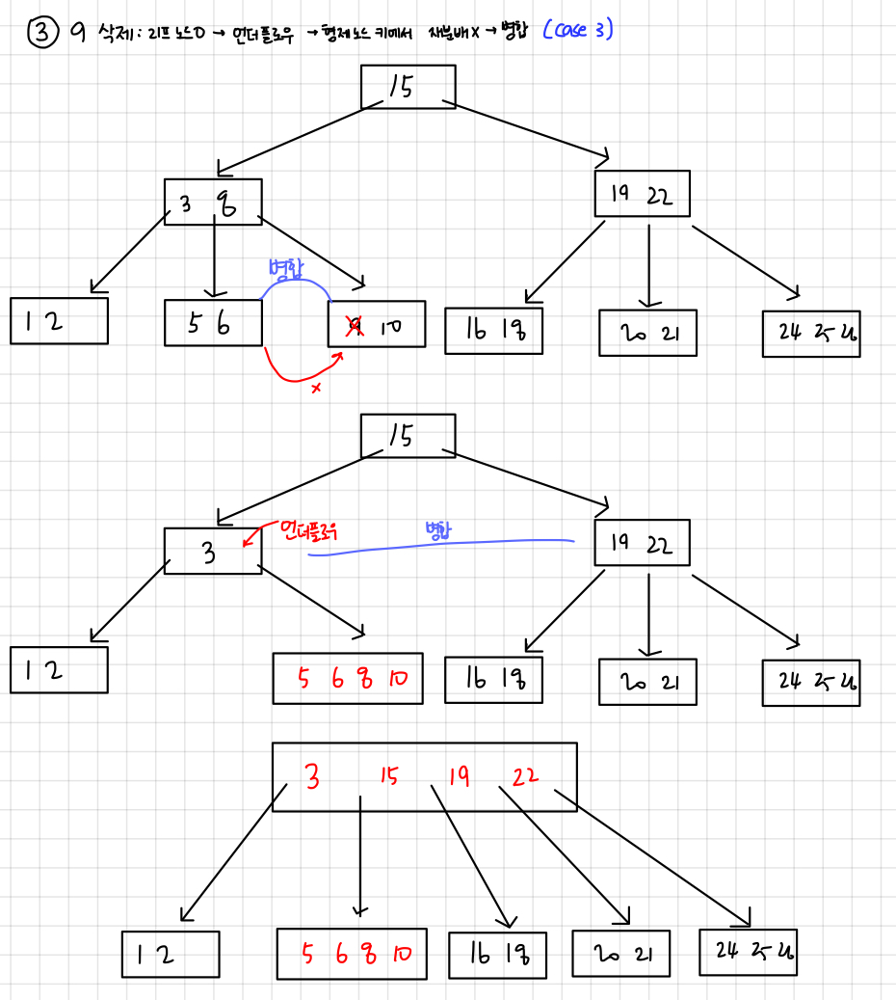

# B-Tree & B+Tree

# B-트리

내장 색인: 메모리에 올려서 사용 (이진 검색 트리)

외장 색인: 메인 메모리 외부에 놓고 사용하는 색인 (B-트리)

색인의 규모가 클 경우 or 메인 메모리가 충분하지 않을 때 디스크에 두고 사용

디스크 접근 시간으로 인한 비효율을 최대한 줄여야 함

- **B-트리: 디스크 환경에서 사용하기 적합한 외장 다진 검색 트리**

**최대 *M*개의 자식**을 가질 수 있는 B트리=*M*차 B트리

$key_{i-1} < T_i < key_i$

## 성질

1. 루트를 제외한 모든 노드는 $\frac k 2$ ~k개의 키를 갖는다. 
    -  k: 한 블록이 수용할 수 있는 최대 키의 개수
    -  예외: 루트 노드는 적어도 2개 이상의 자식을 가짐
2. 모든 리프 노드는 같은 깊이를 가진다.
3. 각 key들의 왼쪽 자식들은 항상 key보다 작은 값을, 오른쪽은 큰 값을 가진다.
4. 노드의 자료수가 **N**이면, 자식 수는 **N+1**이어야 함
    
    ex. 노드의 자료수(key)가 3개라면, 그 노드의 자식 수는 4개
    
    $key_1, key_2, key_3$
    
    $node_1 < key_1$
    
    $key_1 < node_2 < key_2$
    
    $key_2 < node_3 < key_3$
    
    $node_4 > key_3$
    
5. 각 노드의 자료는 **정렬**된 상태여야함
6. 입력 자료는 **중복**될 수 없음

### 장점

- 삽입, 삭제 후에도 균형 트리 유지
- 효율적인 알고리즘 제공 (이진 트리보다 빠름)
- 저장 장치의 효율성
- 균등한 탐색 속도 보장 가능

### 단점

- 삽입/삭제 시 복잡한 연산

## 알고리즘

### 검색

기본적으로 이진 검색 트리의 검색과 같음

1. 루트 노드부터 시작
2. 노드의 여러 키 중 검색 키와 일치하는 것이 있는지 확인
3.   인 두 키 과 를 찾아 분기해야 할 자식 노드를 찾음
4. 자식으로 분기하고 나면 깊이만 하나 내려간 똑같은 검색 문제(다시 자식 노드를 찾음) → 재귀적 과정

### 삽입

ex) 각 노드가 최대 5개의 키를 가질 수 있다고 가정

루트 노드를 제외하고 2~5개의 키를 가져야 한다.

1. x를 삽입할 리프 노드 r을 찾는다. (검색)
2. 노드 r에 공간의 여유가 있으면 키를 삽입하고 끝낸다. **(case 1)**
3. 노드 r에 여유가 없으면 형제 노드에 공간의 여유가 있는지 살펴본다. 
    -  형제 노드에 공간의 여유가 있으면 키를 하나 넘기고 끝낸다. **(case 2)**
        
        
        
    -  형제 노드에 여유가 없으면 노드를 2개로 분리한다. 분리 작업은 부모 노드로 키를 하나 넘기는 작업을 포함한다. **(case 3)**
        
        
        

### 삭제

1. x를 키로 갖고 있는 노드를 찾는다. (검색)
2. 리프노드인지 아닌지 확인
    - 리프노드라면 바로 삭제 (case 1)
        
        
        
    -  리프노드가 아니라면 x의 직후 원소 r과 x를 교환한 후, 리프 노드 x 제거 (case 2)
        
        
        
3. x를 제거한 후 노드에 언더플로우가 발생하면 해소한다. (case 3)

### 작업 성능

d진 검색 트리가 균형을 잘 맞추면 높이가 $log_dn$에 근접

B-트리에서 임의의 노드가 최대 d개의 자식을 가질 수 있다면, 최소한 $\frac {d-1} 2$+1개에서 $\frac d 2$개의 자식을 가져야 함

→ 높이는 $O(log n)$

- 작업 수행시간은 디스크 접근 횟수를 기준으로 함

**검색**

$O(log n)$ (높이)

**삽입**

실패하는 검색을 한 번 수행 $O(log n)$

오버플로우가 최대한 발생하더라도 높이에 비례하는 시간 $O(log n)$ 

→ $O(log n)$

**삭제**

삭제 원소 검색 + 직후 원소를 찾는 작업($O(log n)$

언더플로우 최대 $O(log n)$

→ $O(log n)$

→ 두 작업 모두 이진 검색 트리에 비해 빠름

---

# B+Tree

- 브랜치 노드(리프 노드가 아닌 노드): key를 저장
- 리프 노드: data 저장 (data가 key일 수도 있음!)
- 리프 노드끼리 Linked List로 연결

→ key인 data는 리프 노드와 브랜치 노드에 중복 저장 가능 

→ 리프 노드(데이터가 담긴 노드)에서는 데이터가 중복X

[https://zorba91.tistory.com/293](https://zorba91.tistory.com/293)

### 장점

- B-Tree의 순회 작업 단점 보완 → 모든 데이터를 탐색할 때 순차 탐색이 가능 ( 리프 노드에 모든 데이터가 저장)
- 리프 노드를 제외한 브랜치 노드에 key 값만 담기 때문에 차지하는 메모리가 적음 → 더 많은 key 배치 가능(트리의 높이가 낮아짐) → **key 탐색 시 더 빠른 성능**: B-Tree보다 성능이 더 좋음

### 단점

- B-Tree의 경우 데이터가 루트 노드에 가깝게 위치해 있을 경우 검색이 빠르지만, B+Tree는 특정 데이터 검색을 위해 리프 노드까지 도달해야 함

[https://rebro.kr/167](https://rebro.kr/167)

## 알고리즘

삽입, 삭제는 B-Tree와 유사하지만 일부 과정에서 차이

### 삽입

[http://egloos.zum.com/sweeper/v/899699](http://egloos.zum.com/sweeper/v/899699)

1. 5 삽입 

2. 한 노드당 최대 데이터: 3개 → 오버 플로우

3. 리프 노드 분열 → 5가 새로운 키가 됨

cf. 리프 노드(데이터)가 아닌 키에서 분열할 때는 값 복사x 

4. 9, 13, 16, 18 블록: 오버플로우

   그러나 data 노드가 아니기 때문에 일반 B-Tree처럼 분열

---

### 삭제

1. 9 삭제

2. 9는 data인 동시에 key → 그러나 key는 다른 값을 찾는 데에 필요하기 때문에 data(리프 노드)만 삭제!

9를 삭제하면 underflow → 병합

3. 이때 브랜치노드에 있던 9는 key 였고, (3,4,6) 블럭과 (9) 블럭이 병합되었기 때문에 더이상 키의 기능x → 삭제 

4. 9가 없어져서 브랜치 노드에 underflow → 병합

- 요약

  - 재배치와 합병이 필요하지 않을 때는 leaf 노드에서만 삭제된다.

  - Index 부분은 다른 key 값을 찾는데 사용될 수 있기 때문에 leaf node의 값이 삭제되어도 삭제하지 않는다.

  - 재배치할 경우 index 부분의 node의 key 값은 변하지만 tree 구조는 변하지 않는다.

  - 합병을 할 경우 index 부분에서도 key 값을 삭제한다.

[http://egloos.zum.com/sweeper/v/899699](http://egloos.zum.com/sweeper/v/899699)

---

[https://zorba91.tistory.com/293](https://zorba91.tistory.com/293)