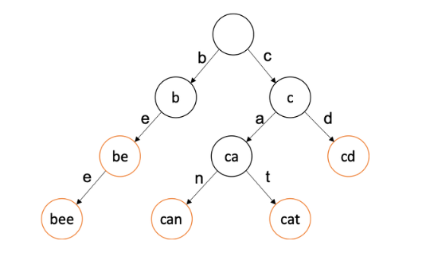
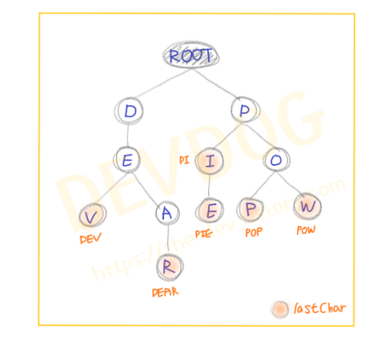

# Trie

# Trie

Trie 란?



- 트라이Trie 알고리즘은 문자열을 트리 구조로 저장 및 탐색하는 알고리즘 기법 중의 하나
- 보통 트리의 구조에는 단일 int형 변수를 저장, Trie는 이를 문자열 형태로 저장
- 구현 시 검색어 자동 완성, 사전 검색, 문자열 검사 등에 사용
- 하나의 노드는 알파벳일 경우 26개의 자식노드, 숫자일 경우 10개의 자식 노드가 생길 수 있습니다. 또한, 한 노드당 그 만큼의 포인터 배열을 설정해주어야 하기 때문에 공간복잡도를 많이 소모


Trie 예시

### 시간복잡도

제일 긴 문자열의 길이를 `L` 총 문자열들의 수를 `M`이라 할 때 시간복잡도

- **생성시 시간복잡도**: `O(M x L)`, 모든 문자열들을 넣어야하니 M개에 대해서 트라이 자료구조에 넣는건 가장 긴 문자열 길이만큼 걸림.  삽입 자체는 `O(L)`만큼 소요.
- **탐색시 시간복잡도**: 최대 `O(L)`, 가장 긴 문자열의 길이만큼만 탐색하기 때문. 탐색하려는 단어의 길이가 `N`일 때 `O(N)`만큼 소요.
- Trie는 왜 쓸까? 문자열은 단순 트리 이진검색시 `O(N*logM)` 복잡도가 걸림. 문자열은 노드 내에서 한번 더 검색을 해야 하므로. 때문에 시간복잡도가 `O(N)`인 Trie를 쓰는 것이 효율적

한 문자열을 저장하게 되면 트리의 구조를 띄기 때문에 그 **문자열의 접두사를 자동으로 모두 구할 수 있음**

### **java 코드로 Trie를 구현해 보기 : 탐색 및 삭제**

- 코드 및 설명 보기
    
    TrieNode : Trie자료구조의 구성
    
    ```java
    import java.util.HashMap;
    import java.util.Map;
    
    public class TrieNode {
    
    	// [ 변수 ]
    	// 자식 노드 맵
    	private Map<Character, TrieNode> childNodes = new HashMap<>();
    	// 마지막 글자인지 여부
    	private boolean isLastChar;
    	
    	// [ GETTER / SETTER 메서드 ]
    	// 자식 노드 맵 Getter
    	Map<Character, TrieNode> getChildNodes() {
    		return this.childNodes;
    	}
    	// 마지막 글자인지 여부 Getter
    	boolean isLastChar() {
    		return this.isLastChar;
    	}
    	// 마지막 글자인지 여부 Setter
    	void setIsLastChar(boolean isLastChar) {
    		this.isLastChar = isLastChar;
    	}
    	
    }
    출처: https://the-dev.tistory.com/3 [DevLogs:티스토리]
    ```
    
    Trie : insert, contain, delete 구현
    
    ```java
    public class Trie {
    
    	// [ 변수 ]
    	// 루트 노드
    	private TrieNode rootNode;
    
    	// [ 생성자 ]
    	Trie() {
    		rootNode = new TrieNode();
    	}
    
    	// [ 메서드 ]
    	// 자식 노드 추가
    	void insert(String word) {
    		TrieNode thisNode = this.rootNode;
    
    		for (int i = 0; i < word.length(); i++) {
    			thisNode = thisNode.getChildNodes().
    								computeIfAbsent(word.charAt(i), c -> new TrieNode());
    		}	
    		thisNode.setIsLastChar(true);
    	}
        
    	// 특정 단어가 들어있는지 확인
    	boolean contains(String word) {
    		TrieNode thisNode = this.rootNode;
    
    		for (int i = 0; i < word.length(); i++) {
    			char character = word.charAt(i);
    			TrieNode node = thisNode.getChildNodes().get(character);
    
    			if (node == null)
    				return false;
    
    			thisNode = node;
    		}
    
    		return thisNode.isLastChar();
    	}
        
    	// 특정 단어 지우기
    	void delete(String word) {
    		delete(this.rootNode, word, 0); // 최초로 delete 던지는 부분
    	}
    	
    	private void delete(TrieNode thisNode, String word, int index) {
    		
    		char character = word.charAt(index);
    
    		// APPLE, PEN과 같이 아예 없는 단어인 경우 에러 출력
    		if(!thisNode.getChildNodes().containsKey(character))
    			throw new Error("There is no [" + word + "] in this Trie.");
    
    		TrieNode childNode = thisNode.getChildNodes().get(character);
    		index++;
    
    		if(index == word.length()) {
    			// 삭제조건 2번 항목
    			// PO와 같이 노드는 존재하지만 insert한 단어가 아닌 경우 에러 출력
    			if (!childNode.isLastChar()) 
                	throw new Error("There is no [" + word + "] in this Trie.");
    
    			childNode.setIsLastChar(false);
                
    			// 삭제조건 1번 항목
    			// 삭제 대상 언어의 제일 끝으로써 자식 노드가 없으면
    			// (이 단어를 포함하는 더 긴 단어가 없으면) 삭제 시작
    			if (childNode.getChildNodes().isEmpty())
    				thisNode.getChildNodes().remove(character);
    		}else {
    			delete(childNode, word, index); // 콜백함수부분
    			
    			// 삭제조건 1,3번 항목
    			// 삭제 중, 자식 노드가 없고 현재 노드로 끝나는 다른 단어가 없는 경우 이 노드 삭제
    			if(!childNode.isLastChar() && childNode.getChildNodes().isEmpty())
    				thisNode.getChildNodes().remove(character);
    		}
    	}
    }
    
    출처: https://the-dev.tistory.com/3 [DevLogs:티스토리]
    ```
    
    - insert
        - 입력 받은 단어의 각 알파벳을 계층 구조의 자식 노드로 만들어 넣습니다.
        이 때, 이미 같은 알파벳이 존재하면 공통 접두어 부분까지는 생성하지 않습니다.
        즉, 해당 계층 문자의 자식 노드가 존재하지 않을 때에만 자식 노드를 생성해줍니다.
        - 예를 들면, 이미 'DEV'가 들어있는 Trie에 'DEAR'를 넣을 때, 'DE-'는 중복이므로 'D-E-'노드 아래 '-A-R'만 추가로 자식 노드를 생성해 주는 것입니다.
        - 마지막 글자에서는 이 문자를 끝으로 하는 단어가 존재한다는 표시를 위해 setIsLastChar(true) 해줍니다.
        
    - contain
        - 특정 단어가 Trie에 존재하는지를 확인하기 위해서는 다음 두 가지 조건을 만족시켜야 합니다.
            1. 루트노드부터 순서대로 알파벳이 일치하는 자식노드들이 존재 할 것
            2. 해당 단어의 마지막 글자에 해당하는 노드의 isLastChar가 true일 것
            (해당 글자를 마지막으로 하는 단어가 있다는 뜻)
            
            여기서 두 번째 조건에 유념해야 합니다.
            예를 들어, Trie에는 'POW'와 'PIE'라는 단어만 등록되어 있는데, 'PI'라는 단어를 검색할 때
            'PI'는 'PIE'와 'PI-'가 일치하기 때문에 1번 조건에는 부합(PI가 PIE에 포함되는 단어)하지만, insert 메서드에서 'PIE'의 '-E'에만 setIsLastChar(true) 했기 때문에 2번 조건에는 부합하지 않아 Trie에 없는 단어임을 확인 할 수 있게 됩니다.
            
        
    - delete
        - contains 메서드처럼 주어진 단어를 찾아 하위 노드로 단어 길이만큼 내려갑니다.
        주의할 점은 노드들이 부모노드의 정보를 가지고 있지 않기 때문에, 하위 노드로 내려가며 삭제 대상 단어를 탐색하고 다시 올라오며 삭제하는 과정이 **콜백(callback)** 형식으로 구현되어야 한다는 점입니다.
        - 탐색 진행방향 : 부모 노드 → 자식 노드
        - 삭제 진행방향 : 자식 노드 → 부모 노드
        - 삭제 진행은 마지막 글자에서 부모 노드 방향으로 되돌아 오는 과정에서 진행된다는 점에 유의하여 다음 삭제 조건들을 살펴봅니다.
            1. 자식 노드를 가지고 있지 않아야 합니다.
            아래 그림에서 'PI'를 지워버리면 'PIE'까지 삭제되어 버리기 때문입니다.
            2. 삭제를 시작하는 첫 노드는 isLastChar==true여야 합니다.
            false인 경우는 Trie에 없는 단어란 뜻이기 때문입니다.
            예를 들어, 위 그림에서 'PO'이라는 글자를 지우라고 명령을 내려도 Trie가 가지고 있지 않는 단어라는 점입니다.
            3. 삭제를 진행하던 중에는 isLastChar==false여야 합니다.
            삭제 과정 중에서 isLastChar가 true라는 것은 또다른 단어가 있다는 의미이므로, 해당 단어는 삭제 대상이 아닙니다.
            'PIE'를 삭제 대상으로 했을 때, '-E'를 삭제후 'PI'라는 단어의 'I'가  isLastChar==true이므로 또 다른 단어가 있음을 알려줍니다.
            
            
            

***s문자열에서 만들 수 있는 모든 부분 문자열의 사전식 정렬상태에서 k번째 문자열을 찾아라***

- 코드 보기
    
    ```java
    import java.util.Arrays;
     
    /**
     *
     * 특정 문자열의 모든 부분 문자열을 정렬된 상태로 알고 싶을 때
     * 특정 문자열의 모든 접미사를 구함 -> 정렬 -> 각 접미사의 모든 접두사를 구함
     * 
     * 트라이(Trie) : 문자열의 집합을 표현하는 트리
     * 접미사의 트라이 : 문자열의 접미사의 트라이의 압축된 표현
     *
     * 접미어 트리(Suffix Tree) : Compressed Trie를 개선, 문자열 끝에 $를 붙여서 표시
     *     생성 시간복잡도 O[n^2] => O[n log n] => O[n]
     * 접미어 배열(Suffix Array) : 접미어들을 사전식으로 나열한 배열, 속도가 느림, 
    															메모리 절약 1/4, 소스가 간단. 생성 시간복잡도 O[n log n]
     * LCP 배열 : (Longest Common Prefix) 최장 공통 접두어, 
    \             접미어 배열을 사용시 보조적으로 필요함
     *     두 문자열 사이의 공통 접두어의 길이
     * 
     */
     
    public class Z40_SuffixArray {
     
        public static void main(String[] args) {
            
            // banana의 모든 부분 문자열을 정렬된 상태로 출력
            String s = "banana";
            
            // s 문자열의 모든 접미사 생성
            int[] sa = new int[s.length()]; 
    				// Suffix Array : index번째에서 시작하는 문자열s의 접미사
            for (int i = 0; i < sa.length; i++) {
                sa[i] = i;
            }
            
            // s 문자열의 모든 접미사 정렬 => 전체 알고리즘에서 가장 오래 걸리는 부분
            for (int i = 0; i < sa.length; i++) { // 선택 정렬
                int minIndex = i;
                for (int j = i; j < sa.length; j++) {
                    // s.substring(sa[minIndex])와 s.substring(sa[j])을 비교
                    if(s.substring(sa[minIndex]).compareTo(s.substring(sa[j])) > 0) {
                        minIndex = j;
                    }
                }
                
                int temp = sa[minIndex];
                sa[minIndex] = sa[i];
                sa[i] = temp;
            }
            
            // LCP 최장 공통 접두어 저장할 배열을 준비
            int[] LCP = new int[s.length()];
            // LCP[4] = s.substring(sa[3])와 substring(sa[4])의 최장공통접두어의 개수
            for (int i = 1; i < LCP.length; i++) { // 1번부터 시작한다
                String s1 = s.substring(sa[i-1]);
                String s2 = s.substring(sa[i]);
                while( s1.length() > LCP[i] // 글자가 적을 경우 index 에러 발생할 수 있음 
                        && s2.length() > LCP[i] 
                        && s1.charAt(LCP[i]) == s2.charAt(LCP[i])) {
                    LCP[i]++;
                }
            }
            
            System.out.println(Arrays.toString(LCP) + " : LCP");
            
            
            /*
            // 출력
            System.out.println(Arrays.toString(sa) + " : Suffix Array");
            for (int i = 0; i < sa.length; i++) {
                String str = s.substring(sa[i]); // 접미사
                System.out.println("<"+str+">");
                
                // 각 접미사의 모든 접두사를 생성
                for (int j = 1; j <= str.length(); j++) {
                    System.out.println(str.substring(0, j)); 
    						// 접두사 = i~j의 부분문자열
                }
                
                System.out.println(str.length() + " : 접두사의 개수"); 
    						// = 해당 접미사의 길이
                System.out.println(LCP[i] + " : 최장공통 접두사의 개수"); 
    						// 중복된 문자열의 개수를 파악하기 위해서 사용
                System.out.println(str.length() - LCP[i] + ":유효한 부분 문자열의 개수"); 
            }
            */
            
            System.out.println("\n\n문제풀이");
            System.out.println("s문자열에서 만들 수 있는 모든 부분 문자열의 사전식 정렬상태에서 k번째 문자열");
            
            int k = 12;
            int index = k;
            for (int i = 0; i < sa.length; i++) {
                String str = s.substring(sa[i]);
                if (index - (str.length() - LCP[i]) > 0) {
                    index = index - (str.length() - LCP[i]); 
    								// 유효한 문자열의 개수를 차감
                } else { // 이 접미사의 접두사들에서 k번째 문자열이 포함되어 있다
                    System.out.println(str.substring(0, LCP[i] + index)); 
    									// k번째 접미사
                    break;
                }
            }
            
        } // end of main
    } // end of class
    ```
    

추가사항

[https://doublesprogramming.tistory.com/253](https://doublesprogramming.tistory.com/253)