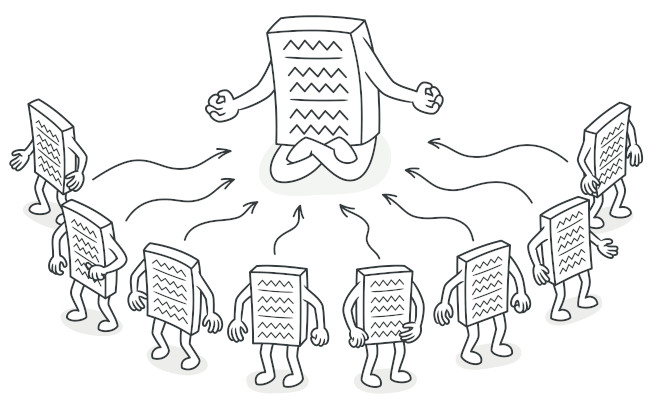
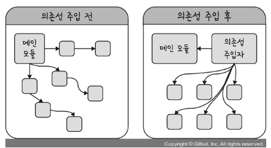
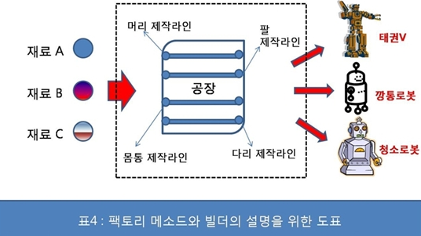
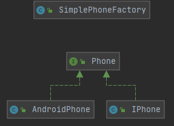
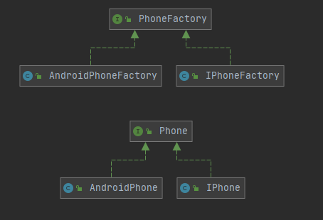
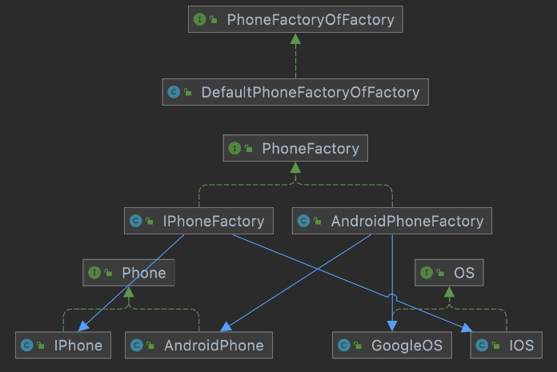

# 디자인 패턴 : 싱글톤, 팩토리

### -디자인 패턴이란?

<aside>
💡 **디자인 패턴**이란, 프로그램을 설계할 때 특정 문맥에서 공통적으로 발생하는 문제에 대해 재사용 가능한 해결책이며 일종의 규약의 형태를 가진다.

</aside>

## 싱글톤 패턴(Singleton Pattern)



### -싱글톤 패턴이란?

<aside>
💡 **싱글톤 패턴(Singleton Pattern)**이란, 하나의 클래스가 오직 하나의 인스턴스만 가지는 패턴이다.

</aside>

### -싱글톤 패턴을 사용하는 이유

- 한번의 new 연산자를 통해서 고정된 메모리 영역을 사용하기 때문에 추후 해당 객체에 접근할 때 **메모리 낭비를 방지**할 수 있다.
- 싱글톤으로 만들어진 클래스의 인스턴스는 전역으로 사용되기 때문에 다른 클래스의 인스턴스들이 접근해 **데이터를 공유하기 쉽다.**
- 이미 생성된 인스턴스를 활용하므로 두 번 이상 사용시 객체 로딩 시간이 줄어 **속도 측면**에서 이점이 있다.
- **인스턴스가 절대적으로 한 개만 존재하는 것을 보증**하고 싶을 경우 사용한다. 이를테면 DB연결 모듈 등에서 활용한다.

### -싱글톤 패턴의 단점

- TDD(Test Driven Development), **테스트하기 어렵다**. 테스트 시 주로 단위 테스트를 하는데, 싱글톤 인스턴스는 자원을 공유하고 있기 때문에 테스트가 결정적으로 격리된 환경에서 수행되려면 매번 인스턴스의 상태를 초기화시켜주어야 한다. 그렇지 않으면 어플리케이션 전역에서 상태를 공유하기 때문에 테스트가 온전하게 수행되지 못한다.
- 싱글톤 인스턴스가 너무 많은 일을 하거나 많은 데이터를 공유시킬 경우에 다른 클래스의 인스턴스들 간에 결합도가 높아져 **개방-폐쇄 원칙(OCP  원칙)**을 위반할 수 있다.
    - **개방-폐쇄 원칙(OCP  원칙) :**  '소프트웨어 개체(클래스, 모듈, 함수 등등)는 확장에 대해 열려 있어야 하고, 수정에 대해서는 닫혀 있어야 한다'
- 의존관계상 클라이언트가 구체클래스에 의존하게 된다. 이 경우 **의존성 역전 원칙(DIP 원칙)**을 위반할 수 있다.
    - 구체클래스 : new 키워드를 사용하여 인스턴스를 만들 수 있는 클래스. 추상메소드를 가질 수 없음
    - **의존성 역전 원칙(DIP 원칙) :** 고수준 모듈은 저수준 모듈의 구현에 의존해서는 안 된다. 저수준 모듈이 고수준 모듈에서 정의한 추상 타입에 의존해야 한다. → 자신보다 변하기 쉬운 것에 의존하지 말 것
- 이외에도 자식클래스를 만들수 없다는 점과, 내부 상태를 변경하기 어렵다는 점 등 여러가지 문제들이 존재한다. 한마디로 싱글톤 패턴은 유연성 측면에서 뒤떨어지는 디자인 패턴이다.

### -싱글톤 패턴의 Java 코드 예시

```java
public class Singleton {
    
    private static final Singleton instance = new Singleton();
    
    // private constructor to avoid client applications to use constructor
		//클라이언트가 해당 생성자를 바로 쓰지 못하도록 private로 정의한다. 
    private Singleton(){}
	 
		//클라이언트는 getInstance()함수를 통해 동일 객체를 활용할 수 있다.
    public static Singleton getInstance(){
        return instance;
    }
}
```

### -의존성 주입(DI)



- 싱글톤 패턴이 가진 단점-모듈간의 결합을 강하게 만들 수 있음-을 의존성 주입을 통해 보완할 수 있다.
    - **의존성**이란? A가 B에 의존성이 있을 경우, 의존대상 B가 변하면  A에 영향을 미친다. 이를 의존성이라 하며 다른 말로는 종속성이라고도 한다.
- **외부에서 객체를 생성 및 주입**해서 의존관계를 재정의하는 방식으로 구현
- 강하게 결합된 클래스들을 분리하고, 애플리케이션 실행 시점에 객체 간의 관계를 결정해 줌으로써 **결합도를 낮추고 유연성을 확보**해준다.
- 장점으로는 **단위테스트**가 용이해지고, **코드의 재활용** 및 **리팩토링**이 용이해지며 객체간의 의존성과 결합도를 낮출 수 있어 유연한 코드 작성이 가능해진다는 점들이 있다.
- **Spring Framework**가 이러한 의존성 주입 모델을 지원한다.

### -의존성 주입의 Java 코드 예시

**의존성 주입 사용 전**

```java
// 커피 클래스
class Coffee {
    public void drink() {
     커피를 마신다
     ...
  }
}
// 커피 인터페이스로도 가능
interface Coffee {
    public void drink()
}

// 커피 클래스를 상속
class Cappuccino extends Coffee {...}
class Americano extends Coffee {...}

// 회사원 클래스
class SalaryMan {
    private Coffee coffee;

    public SalaryMan() {
        this.coffee = new Coffee();
        // 커피가 바뀌거나 추가 될 때마다 지속적으로 코드를 수정해야함.
        this.coffee = new Cappuccino(); 
        this.coffee = new Americano(); 
  }

  public startWorking() {
    this.coffee.drink();
  }
}
```

**의존성 주입 사용 후**

```java
// 커피 클래스
class Coffee {
    public void drink() {
     커피를 마신다
     ...
  }
}

// 커피 클래스를 상속
class Cappuccino extends Coffee {...}
class Americano extends Coffee {...}

// 회사원 클래스
class SalaryMan {
    private Coffee coffee;

    // 클래스에서 직접 생성하는 것이 아닌 외부에서 사용할 때 주입해줌으로서, 
  // 객체 간의 결함도를 줄이고 좀 더 유연한 코드를 작성할 수 있음.
    public SalaryMan(Coffee coffee) {
        this.coffee = coffee;
  }

  public startWorking() {
    this.coffee.drink();
  }
}

// 회사 클래스 - 일반적인 생성자 주입
class Company {
    public pickUpEmployee() {
        Coffee myCoffee = new Americano();
        // 클래스에서 관계를 수정하는 것이 아닌 사용하는 외부에서 클래스를 주입해줌.
    SalaryMan Jun = new SalaryMan(myCoffee);
    }
}
```

## 팩토리 패턴(Factory Pattern)



### -팩토리 패턴이란?

<aside>
💡 팩토리 패턴(Factory Pattern)이란, 객체를 사용하는 코드에서 객체 생성 부분을 떼어내 추상화한 패턴이자 상속 관계에 있는 두 클래스에서, **상위 클래스**가 중요한 **뼈대**를 결정하고, **하위 클래스**에서 객체 생성에 관한 **구체적인 내용**을 결정하는 패턴이다.

</aside>

### -팩토리 패턴을 사용하는 이유

팩토리 패턴은 **생성패턴**(Creational Pattern) 중 하나이다. 

생성 패턴은 인스턴스를 만드는 절차를 추상화하는 패턴으로, 중요한 이슈가 2가지 있다.

- **생성 패턴은 시스템이 어떤 Concrete Class(구체클래스)를 사용하는지에 대한 정보를 캡슐화한다.**
- **생성 패턴은 이들 클래스의 인스턴스들이 어떻게 만들고 어떻게 결합하는지에 대한 부분을 완전히 가려준다.**

즉, 생성패턴은 유연성 확보를 용이하게 해준다.

### -팩토리 패턴의 장단점

- 팩토리 패턴은 클라이언트 코드로부터 서브 클래스의 인스턴스화를 제거하여 서로 간의 **종속성을 낮추고, 결합도를 느슨하게** 하며(Loosely Coupled), **확장을 쉽게** 한다.
    - 예를 들어 하위 클래스에서 수정 삭제가 일어나도 클라이언트에 영향을 주지 않으므로 상위 클래스 코드를 변경할 필요가 없음
- 팩토리 패턴은 클라이언트와 구현 객체들 사이에 **추상화**를 제공한다.
    - 즉 하위 클래스 대체가 용이하고 다양한 특성을 줄 수 있다.
    - 하위 클래스간의 일관성도 증진시킬 수 있다.

- 단점으로는, 생성할 객체가 늘어날 때마다 그 객체를 생성하는 팩토리도 추가되므로 **관리할 클래스가 선형적으로 증가**할 수 있다는 점이 있다.

### -팩토리 패턴의 종류 및 Java 코드 예시

**0 . 심플 팩토리 Simple Factory**

팩토리 패턴에는 팩토리 메소드 패턴, 추상 팩토리 패턴 이있다. 

이 두 가지 패턴을 알기전에 먼저 두 패턴의 베이스인 심플 팩토리 패턴을 확인할 필요가 있다.

<aside>
💡 **심플 팩토리 패턴**은 단순히 객체를 만드는 작업을 하나의 팩토리 클래스에 모아두는 것을 의미한다.

</aside>

휴대폰 주문 코드 예시

```java
//휴대폰을 만드는 공장
public class SimplePhoneFactory {
    public Phone orderPhone(String type) {
        Phone phone = createPhone(type);
        phone.complete();
        return phone;
    }
    private Phone createPhone(String type) {
        return switch (type) {
            case "IPHONE" -> new IPhone();
            case "ANDROID" -> new AndroidPhone();
            default -> null;
        };
    }
}

//휴대폰 인터페이스
public interface Phone {
    void complete();
    void call();
}

//아이폰
public class IPhone implements Phone{
    @Override
    public void complete() {
        System.out.println("아이폰 완성");
    }

    @Override
    public void call() {
        System.out.println("아이폰으로 전화를 한다");
    }
}

//안드로이드 폰
public class AndroidPhone implements Phone{
    @Override
    public void complete() {
        System.out.println("안드로이드폰 완성");
    }

    @Override
    public void call() {
        System.out.println("안드로이드폰으로 전화를 한다");
    }
}

//클라이언트는 휴대폰 공장에 휴대폰을 주문한다.
public class Practice {
    public static void main(String[] args){
        SimplePhoneFactory simplePhoneFactory = new SimplePhoneFactory();
        Phone phone = simplePhoneFactory.orderPhone("ANDROID");
        phone.call();
    }
}

//실행 결과
/*
안드로이드폰 완성
안드로이드폰으로 전화를 한다
*/
```



**1 . 팩토리 메소드 패턴 Factory method Pattern**

 

<aside>
💡 **팩토리 메소드 패턴 Factory method Pattern**이란, ****객체를 생성하기 위한 인터페이스를 정의하는 과정에서 어떤 클래스의 인스턴스를 만들지는 서브클래스에서 결정 즉, 클래스의 인스턴스를 만드는 일을 서브클래스에게 맡기는 것을 의미한다.

</aside>

위의 심플 팩토리 코드에 팩토리 메소드 패턴을 적용하면 다음과 같다.

```java
public interface PhoneFactory {
    default Phone orderPhone() {
        Phone phone = createPhone();
        phone.complete();
        return phone;
    }
    Phone createPhone();
}

public class IPhoneFactory implements PhoneFactory {
    @Override
    public Phone createPhone() {
        return new IPhone();
    }
}

public class AndroidPhoneFactory implements PhoneFactory {
    @Override
    public Phone createPhone() {
        return new AndroidPhone();
    }
}

public interface Phone {
    void complete();
    void call();
}
public class IPhone implements Phone{
    @Override
    public void complete() { System.out.println("아이폰 완성"); }
    @Override
    public void call() { System.out.println("아이폰으로 전화를 한다"); }
}
public class AndroidPhone implements Phone{
    @Override
    public void complete() {System.out.println("안드로이드폰 완성");}
    @Override
    public void call() {System.out.println("안드로이드폰으로 전화를 한다");}
}

public class Practice {
    public static void main(String[] args){
        IPhoneFactory iPhoneFactory = new IPhoneFactory();
        Phone phone7 = iPhoneFactory.orderPhone();
        phone7.call();

        AndroidPhoneFactory androidPhoneFactory = new AndroidPhoneFactory();
        Phone phone2 = androidPhoneFactory.orderPhone();
        phone2.call();
    }
}

//실행 결과
/*
아이폰 완성
아이폰으로 전화를 한다
안드로이드폰 완성
안드로이드폰으로 전화를 한다
*/
```



SimplePhoneFactory를 인터페이스화 한다. 그리고 구현체로 IPhoneFactory, AndroidPhoneFactory를 만들고 createPhone()을 각자의 Factory에서 Phone 객체 생성 구현체를 만든다. 

**팩토리 메소드 패턴 정의대로 서브클래스에서 어떤 객체를 생성할지 결정할 수 있게 된다.** 이렇게 구조를 잡는다면 추후 휴대폰의 종류가 늘어난다 해도 Phone구현체 클래스의 생성과 createPhone()의 분기 처리만 해줌으로써 확장이 가능한 구조가 된다. 

즉 클래스 만들 때 확장은 가능하게 하되, 한번 만들면 추후에 수정할 필요 없게 만들라는 원칙인 **OCP (개방 폐쇄의 원칙 : Open Close Principle)**를 따르게 된다.

다만 새로운 제품이 추가될 경우 인터페이스에 새로운 메서드를 추가해야 하고, 그렇게 될 경우 팩토리를 구현한 모든 구현체는 해당 메서드를 오버라이드하라고 요구할 것이다. 물론 이는 Java8 기준 Default 메서드를 사용해서 해결할 수 있지만 오직 새로운 제품에만 사용될 추상 메서드가 인터페이스에 추가되는 것은 바람직하지 못하다.

이를 해결하기 위해 추상 팩토리 패턴을 사용한다.

**2 . 추상 팩토리 패턴 Abstract Factory Pattern**

<aside>
💡 **추상 팩토리 패턴 Abstract Factory Pattern** 이란, 구체적인 클래스에 의존하지 않고 서로 연관되거나 의존적인 객체들의 조합을 만드는 인터페이스를 제공하는 패턴이다.

</aside>

위에서 본 메소드 팩토리 패턴에서는 PhoneFactory의 구현체 IPhoneFactory, AndroidPhoneFactory가 각각 IPhone객체 AndroidPhone객체 하나씩을 생성하게 작성했다.

추상 팩토리 패턴은 이것을 한번더 감싸서 하나의 Factory에서 여러개의 제품군(Product)조합을 생성할 수 있게 해주는 패턴이다.

아이폰에는 IOS를 안드로이드폰에는 Google OS를 설치하는 요구사항을 추가한 예시 코드는 다음과 같다.

```java
public interface PhoneFactoryOfFactory {
    PhoneFactory requestPhone(String company);
}
public class DefaultPhoneFactoryOfFactory implements PhoneFactoryOfFactory{
    @Override
    public PhoneFactory requestPhone(String company) {
        switch (company) {
            case "IPHONE":
                return new IPhoneFactory();
            case "ANDROID":
                return new AndroidPhoneFactory();
        }
        throw new IllegalArgumentException();
    }
}
///

///
public interface PhoneFactory {
    Phone createPhone();
    OS createOS();
}
public class IPhoneFactory implements PhoneFactory{
    @Override
    public Phone createPhone() {
        OS os = createOS();
        os.installOS();
        return new IPhone();
    }
    @Override
    public OS createOS() {
        return new IOS();
    }
}
public class AndroidPhoneFactory implements PhoneFactory{
    @Override
    public Phone createPhone() {
        OS os = createOS();
        os.installOS();
        return new AndroidPhone();
    }
    @Override
    public OS createOS() {
        return new GoogleOS();
    }
}
///

///
public interface OS {
    void installOS();
}
public class IOS implements OS {
    @Override
    public void installOS() {
        System.out.println("IOS 설치");
    }
}
public class GoogleOS implements OS {
    @Override
    public void installOS() {
        System.out.println("구글OS 설치");
    }
}
///

///
public interface Phone {
    public void call();
    public void playGame();
}
public class IPhone implements Phone{
    @Override
    public void call() {
        System.out.println("아이폰으로 전화하다");
    }

    @Override
    public void playGame() {
        System.out.println("아이폰으로 게임하다");
    }
}
public class AndroidPhone implements Phone{
    @Override
    public void call() {
        System.out.println("안드로이드로 전화하다");
    }

    @Override
    public void playGame() {
        System.out.println("안드로이드로 게임하다");
    }
}
///

public class Main {
    public static void main(String[] args) {
        PhoneFactoryOfFactory phoneFactoryOfFactory = new DefaultPhoneFactoryOfFactory();
        PhoneFactory iphoneFactory= phoneFactoryOfFactory.requestPhone("IPHONE");   //아이폰을 산다.
        Phone iphone = iphoneFactory.createPhone();
        iphone.call();
        iphone.playGame();

        PhoneFactory androidPhoneFactory = phoneFactoryOfFactory.requestPhone("ANDROID");   //안드로이드폰을 산다.
        Phone androidPhone = androidPhoneFactory.createPhone();
        androidPhone.call();
        androidPhone.playGame();
    }
}

//실행 결과
/*
IOS 설치
아이폰으로 전화하다
아이폰으로 게임하다
구글OS 설치
안드로이드로 전화하다
안드로이드로 게임하다
*/
```



PhoneFactory는 Phone과 OS를 조합하는 구현체를 제공한다.

이러한 추상 팩토리 패턴의 장단점은 다음과 같다.

- 구체적인 클래스를 사용자로부터 분리할 수 있다.
    - 사용자가 사용할 때는 정의된 인터페이스에 정의된 추상 메소드를 사용만 하면 된다.
    
- 제품군을 쉽게 대체할 수 있다.
    - 예를 들어 내가 만약 IPhone대신 블랙베리 폰을 생성하고 싶다면 BlackBerry를 구현후 IPhoneFactory를 BlackBerryFactory로 변경만 해주면 된다.
    
- 새로운 종류의 제품을 제공할 때마다 코드 수정이 이뤄져야 한다.
    - 만약 PhoneFactory에 createBattery()라는 추상 메소드가 추가된다면 PhoneFactory의 모든 서브 구현체를 다시 수정해야 한다.

### -팩토리 메서드 패턴 VS 추상 팩토리 패턴

- 팩토리 메서드 패턴 그리고 추상 팩토리 패턴 모두 **객체(제품, 이하 객체)를 만드는 과정을 추상화**한 패턴이라는 공통점이 있다.

- **팩토리 메서드 패턴**은 **객체를 만드는 과정에 집중한 패턴**으로, 구체적인 객체의 생성을 메서드로 추상화 하고 ConcreteCreator(제품을 만듦)의 구현 메서드에서 구체적인 객체를 만들어 팩토리 메서드에 제공한다.
    - **1.추상화된 객체 반환하는 추상 메서드,** **2.구체적인 객체를 생성하는 구현 메서드**, **3. 추상 메서드를 호출하는 팩토리 메서드**의 조합이라고 할 수 있다

- **추상 팩토리 패턴**은 팩토리를 사용하는 **클라이언트에 집중한 패턴**으로, 클라이언트는 ConcreteFactory(제품의 정의)가 제공하는 추상화된 인터페이스를 사용함으로써 구체적인 객체를 직접 참조할 필요가 없어진다.
    - **1.객체를 생성하는 추상 메서드를 가진 인터페이스** **2.이를 구현한 ConcreteFactory**, **3. ConcreteFactory를 주입받아 사용하는 클라이언트**에 초점이 맞춰져 있다.

- 두 패턴의 **목적**이 다르다.
1. 팩토리 메서드 패턴은 구체적인 객체 생성과정을 하위 또는 구체적인 클래스로 옮기는 것이 목적이고
2. 추상 팩토리 패턴은 관련 있는 여러 객체를 구체적인 클래스에 의존하지 않고 만들 수 있게 해주는 것이 목적이다.

즉 목적과 용도에 맞게 두 패턴을 적절히 활용하면 된다.

참고 링크

[https://cjw-awdsd.tistory.com/54](https://cjw-awdsd.tistory.com/54)

[https://biggwang.github.io/2019/06/28/Design Patterns/[Design Patterns] 팩토리 패턴, 도대체 왜 쓰는거야-기본 이론편/](https://biggwang.github.io/2019/06/28/Design%20Patterns/%5BDesign%20Patterns%5D%20%ED%8C%A9%ED%86%A0%EB%A6%AC%20%ED%8C%A8%ED%84%B4,%20%EB%8F%84%EB%8C%80%EC%B2%B4%20%EC%99%9C%20%EC%93%B0%EB%8A%94%EA%B1%B0%EC%95%BC-%EA%B8%B0%EB%B3%B8%20%EC%9D%B4%EB%A1%A0%ED%8E%B8/)

[https://kangworld.tistory.com/237?category=1005888](https://kangworld.tistory.com/237?category=1005888)