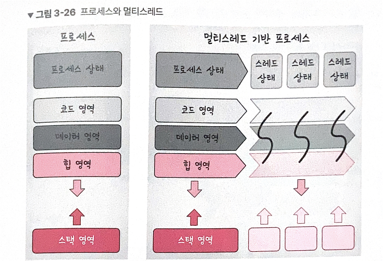
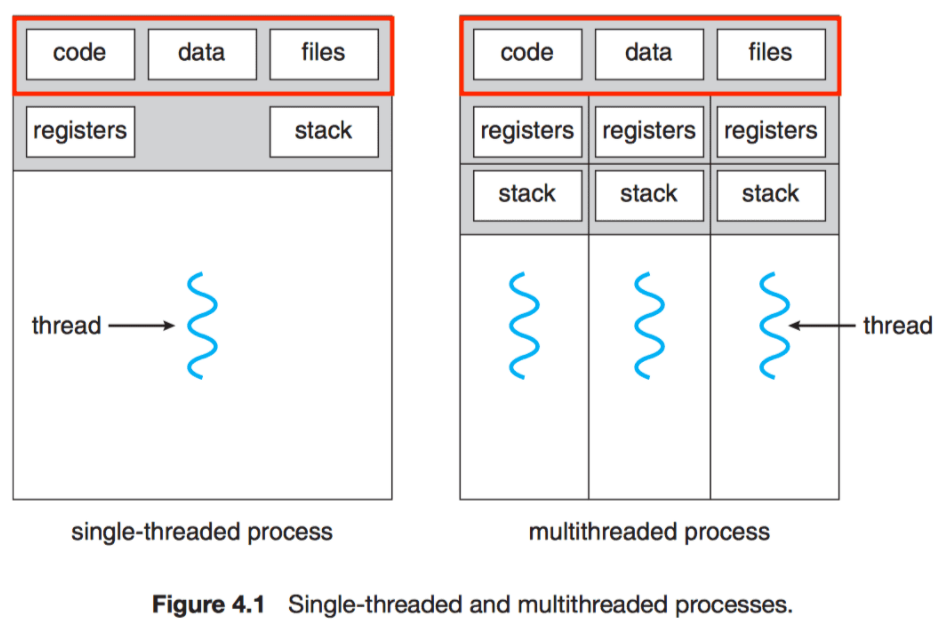
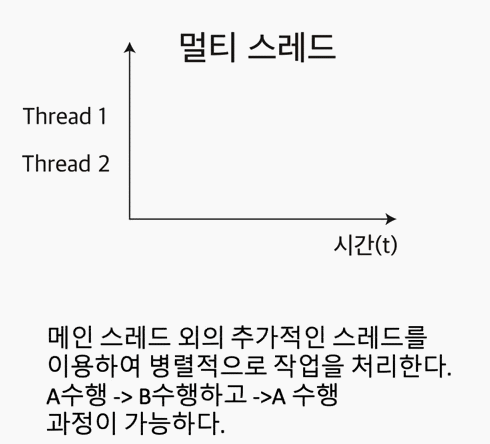

## 3.3.6 스레드와 멀티스레딩

### 스레드

**프로세스의 실행 가능한 가장 작은 단위**

CPU 수행의 기본 단위 또는 프로세스 안의 제어권의 흐름

프로세스는 여러 스레드를 가질 수 있다

**구조**: Thread ID, Program Counter, Register set, Stack space로 구성

각각의 스레드는 주로 최소한 자신의 레지스터 상태와 스택을 갖는다.

↔ Code, Data 섹션이나 운영체제 자원들은 스레드끼리 공유

### 종류

- 싱글 스레드(Single thread)
    - 한 프로세스가 하나의 스레드를 이용하여 한 번에 한 작업만 수행
- 멀티 스레드(Multi thread)
    - 한 프로세스가 여러 스레드로 동시에 여러 작업을 수행

### 필요성

- 프로세스의 생성, Context Switching에 비해 스레드 생성/Switching이 성능 저하가 덜하고 가벼움
- 두 프로세스가 하나의 데이터를 공유하기 위한 IPC는 효율이 떨어지고 개발자가 구현, 관리하기 번거롭다

### 멀티 스레딩

프로세스 내 작업을 멀티스레드로 처리하는 기법

컨텍스트 스위칭 활용 → 스레드 간의 이동

**멀티 프로세스와 멀티 쓰레드의 차이점**

- 멀티 프로세스
    
    <aside>
    💡 두개 이상 다수의 프로세서(`CPU`)가 협력적으로 하나 이상의 작업(`Task`)을 동시에 처리하는 것이다. (병렬처리)
    
    </aside>
    
    - [데이터 영역, 힙, 스택 ]영역 **모두**를 **비공유**
    - 하나의 프로세스가 죽더라도 다른 프로세스에 영향을 주지 않아 안정성이 높음
    - 멀티 스레드보다 많은 메모리공간과 CPU 시간을 차지
- 멀티 쓰레드
    - [ 데이터 영역, 힙, 스택 ]영역중 **스택 영역만** **비공유**
    - 멀티 프로세스보다 적은 메모리 공간을 차지하고 `Context Switching`이 빠르다
    - 동기화 문제와 하나의 스레드 장애로 전체 스레드가 종료 될 위험

**장점**

- **응답성**
    - 싱글 스레드: 작업이 끝나기 전까지 사용자에게 응답x
    - 멀티스레드: 작업을 분리해서 수행하므로 실시간으로 사용자에게 응답 가능
    - 프로그램의 일부분(스레드 중 하나)이 중단되거나 긴 작업을 수행하더라도 프로그램의 수행이 계속됨
    - ex) 멀티 스레드가 적용된 웹 브라우저 프로그램에서 하나의 스레드가 이미지 파일을 로드하고 있는 동안, 다른 스레드에서 사용자와 상호작용 가능
- **자원 공유**
    - 프로세스: 공유 메모리/메시지 패싱을 이용하여 자원을 공유
    - 스레드: 자신이 속한 프로세스 내의 스레드들과 메모리나 자원을 공유하여 효율적으로 사용
    - 스레드 간의 context switching은 캐시 메모리를 비울 필요가 없기 때문에 더 빠르다.
    - 시스템 자원의 낭비가 적다
- **확장성**
    - 한 프로세스를 여러 프로세서에서 수행할 수 있다
- 한 스레드가 중단(blocked)되어도 다른 스레드는 실행(running) 상태일 수 있다

**단점**

- **오버헤드**
    - context switching, 동기화 등의 이유 때문에 싱글 코어 멀티 스레딩은 스레드 생성 시간이 오히려 오버헤드로 작용해 단일 스레드보다 느리다.
- 공유하는 자원에 동시에 접근하는 경우, 스레드는 **데이터와 힙 영역을 공유**하기 때문에 어떤 스레드가 다른 스레드에서 사용 중인 변수나 자료구조에 접근하여 엉뚱한 값을 읽어오거나 수정할 수 있다 → **동기화 필요**
- 동기화를 통해 **작업 처리 순서, 공유 자원**에 대한 접근을 제어 → **병목 현상**
- 멀티 스레딩을 위해서는 **운영체제의 지원**이 필요
- 멀티 스레드 모델은 **프로그래밍 난이도**가 높음
- 스레드 수만큼 **자원을 많이 사용**
- 한 스레드에 문제가 생기면 다른 스레드에도 영향을 끼쳐 프로세스에 영향

---

[https://rebro.kr/174](https://rebro.kr/174)

[https://velog.io/@gil0127/싱글스레드Single-thread-vs-멀티스레드-Multi-thread-t5gv4udj](https://velog.io/@gil0127/%EC%8B%B1%EA%B8%80%EC%8A%A4%EB%A0%88%EB%93%9CSingle-thread-vs-%EB%A9%80%ED%8B%B0%EC%8A%A4%EB%A0%88%EB%93%9C-Multi-thread-t5gv4udj)

[https://goodgid.github.io/What-is-Multi-Thread/](https://goodgid.github.io/What-is-Multi-Thread/)

[https://wooody92.github.io/os/멀티-프로세스와-멀티-스레드/](https://wooody92.github.io/os/%EB%A9%80%ED%8B%B0-%ED%94%84%EB%A1%9C%EC%84%B8%EC%8A%A4%EC%99%80-%EB%A9%80%ED%8B%B0-%EC%8A%A4%EB%A0%88%EB%93%9C/)